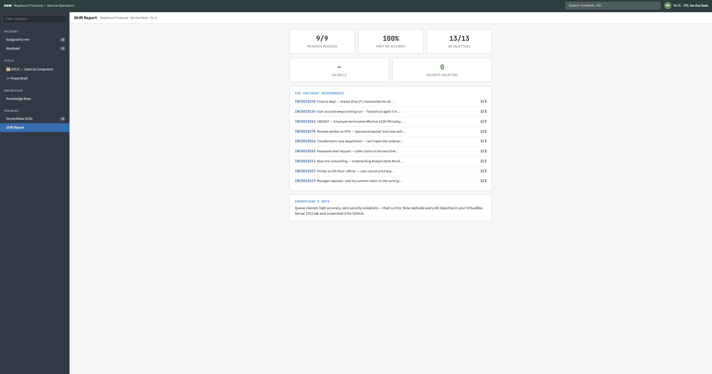

# IT Service Desk Simulator — ServiceNow + Active Directory Lab


An interactive, browser-based training environment that recreates a Tier 1 IT
Service Desk shift at a fictional enterprise ("Maplecore Financial"). It pairs a
**ServiceNow-style incident workflow** with a **simulated Active Directory Users
and Computers (ADUC) console** and a **PowerShell terminal**, so each support
ticket has to be resolved by performing the real administrative action — not
just answering a question.

I use this environment to drill the exact workflows and vocabulary used on real
service desks: incident lifecycle, priority/SLA handling, identity verification,
least privilege, and full user account lifecycle management in both the GUI and
PowerShell. I designed the scenarios and learning objectives around the tasks a
Tier 1 analyst actually performs.

---

## ▶️ Try it

**Live demo:** _(add your GitHub Pages URL here after the Pages step below)_

Runs entirely in the browser — no build step, no dependencies:

```bash
git clone https://github.com/<your-username>/it-service-desk-simulator.git
cd it-service-desk-simulator
open servicenow-ad-lab.html    # macOS  (or just double-click the file)
```

---

## What it covers

### ServiceNow / ITSM workflow
- Incident queue sorted by **Priority (P1–P4)** with live **SLA countdown** timers
- Full incident form: Caller, **Impact × Urgency → derived Priority**,
  Category/Subcategory, Configuration Item, Assignment Group vs. Assigned To
- **State lifecycle:** New → In Progress → Resolved (resolution code + closure
  notes required to resolve)
- **Work notes (internal) vs. Additional comments (caller-visible)** activity stream
- 8 platform-specific **interview drill** questions (incident vs. request,
  the priority matrix, On Hold — Awaiting Caller, SLA breach etiquette, etc.)

### Active Directory — full account lifecycle
Every incident requires real directory work, performed in **either** tool:

| Scenario | AD skill practiced |
|---|---|
| Repeat account lockout | Diagnose + unlock; stale cached credentials; Event ID 4740 |
| Department transfer | Group membership, Kerberos token refresh, least-privilege cleanup |
| Employee termination | **Disable (not delete)**, reset password, move to Retention OU |
| New hire onboarding | Create user from role template, must-change-at-logon, group provisioning |
| Contractor / intern | **Account expiration dates**, task-based (not mirrored) access |
| Pretexting call | Identity verification; refusing unauthorized account actions |

- 🗂 **Simulated ADUC console** — OU tree, user Properties (Account tab +
  Member Of tab), New User wizard
- ＞ **PowerShell terminal** — supports `Get-ADUser`,
  `Search-ADAccount -LockedOut`, `Unlock-ADAccount`, `Add/Remove-ADGroupMember`,
  `Disable-ADAccount`, `Set-ADUser -AccountExpirationDate`, `Move-ADObject`,
  `New-ADUser`, with authentic error messages
- Two built-in **security traps** (a least-privilege violation and an
  unauthorized-access trap) that get logged to the end-of-shift report

---

## Skills demonstrated

`Active Directory` · `ADUC` · `PowerShell` · `ServiceNow` · `ITIL` ·
`Incident Management` · `SLA` · `Identity & Access Management` ·
`Least Privilege` · `User Lifecycle (Joiner-Mover-Leaver)` ·
`Help Desk / Service Desk`

## How I use it

1. Work the full 8-ticket shift in the **ADUC console** (GUI).
2. Reset and run the shift again in **PowerShell only** — same directory, command line.
3. Replicate each Active Directory objective in a live lab (VirtualBox +
   Windows Server 2022 + Windows 10 client) against a real domain controller.


## About this project

This is a personal study and practice tool. The scenarios, ticket content, and
training objectives were designed by me to mirror real Tier 1 responsibilities;
The simulator was assembled with AI assistance as a learning aid.The value of this project is the competency it builds and demonstrates: incident and SLA management, identity verification, least-privilege access, and the full Active Directory user lifecycle (onboarding, transfers, offboarding, lockouts) performed in both Active Directory Users and Computers and PowerShell.  "Maplecore Financial" and all users, tickets, and data are fictional. Not affiliated with ServiceNow or Microsoft.

## License

MIT — see [LICENSE](LICENSE).
